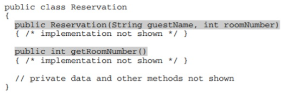
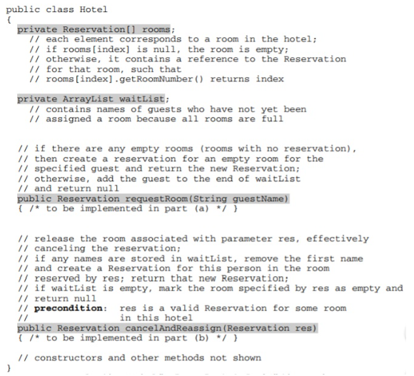
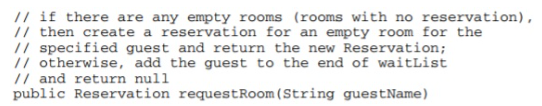

# 8.4-Hotel-Reservations---Quiz

In this question, you will implement two methods for a class Hotel that is part of a hotel reservation system. The Hotel class uses the Reservation class shown below. A Reservation is for the person and room number specified when the Reservation is constructed.

An incomplete declaration for the Hotel class is shown below. Each hotel in the hotel reservation system has rooms numbered 0, 1, 2, . . . , up to the last room number in the hotel. For example, a hotel with 100 rooms would have rooms numbered 0, 1, 2, . . . , 99.

a. Write the Hotel method requestRoom. Method requestRoom attempts to reserve a room in the hotel for a given guest. If there are any empty rooms in the hotel, one of them will be assigned to the named guest and the newly created reservation is returned. If there are no empty rooms, the guest is added to the end of the waiting list and null is returned.

Complete method requestRoom below.

Write the Hotel method cancelAndReassign. Method cancelAndReassign releases a previous reservation. If the waiting list for the hotel contains any names, the vacated room is reassigned to the first person at the beginning of the list. That person is then removed from the waiting list and the newly created reservation is returned. If no one is waiting, the room is marked as empty and null is returned.

In writing cancelAndReassign you may call any accessible methods in the Reservation and Hotel classes. Assume that these methods work as specified.

Complete method cancelAndReassign below.

 
